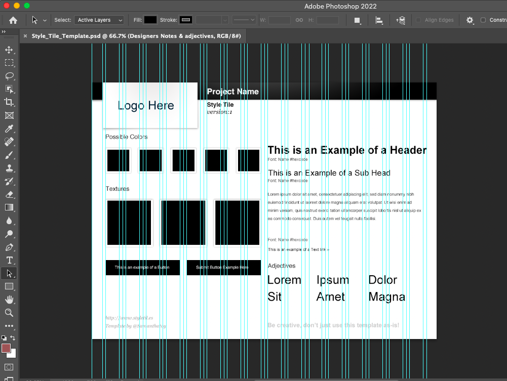
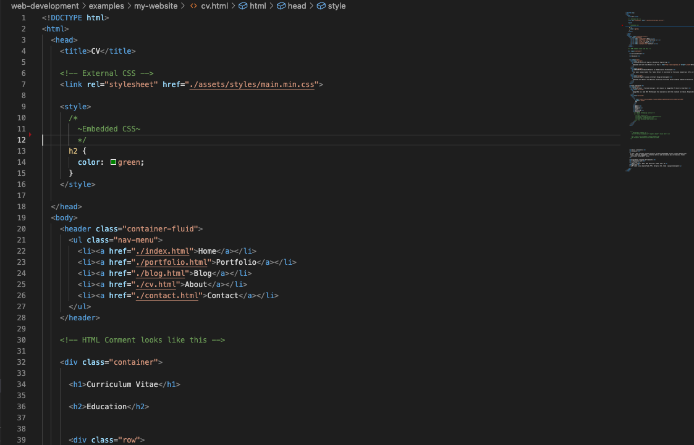
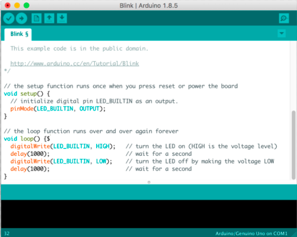

# Key Concepts 

- Web Application Frameworks
- Web Development Workflow
- Common Tools, Wireframes & Flowcharts
- Data Types & Structures 

---

# Web Application Frameworks
A *web framework* or *web application framework*  is a software framework that is designed to support the development of web applications. It gives a basis for analysis of software systems' behavior before the system has been built.
  -  Web frameworks aim to automate the overhead associated with common activities performed in web development.
  - Many web frameworks provide libraries for database access, templating frameworks, and session management.
  - Collection of HTML, CSS and Javascript files that speed up site development by providing a foundation for structure, styling, layout, and functionality.

---

# Web Application Frameworks

  - Benefits: Speeds up development time, compatibility, entie sties can be constructed with minimal styling required by the developer, great for learning about overall site building
  - There are downsides: unusued code, performance issues, coding standards of specific languages, modifying can be time-consuming.
  - Examples: Ruby on Rails, Django, CakePHP, Laravel, Symfony, CodeIgniter, ...
  - Mostly MVC based on the project

--- 

# Workflow Segments in Web Development

- Planning: Project Brief, Content Survey, Strategy
- Design
  - Initial Site Plan (Sketching-Mockups, Style Tiles, Prototypes)
  - Choosing the Right Tools and Frameworks
  - Generating Site Assets: audiovisual media 
- Development: Use Github
- Publishing

---

# Site Tiles

- http://styletil.es/
 Style Tiles are a design deliverable consisting of fonts, colors and interface elements that communicate the essence of a visual brand for the web.

---

#  Exploring Tools
Features to compare when choosing a code editor:
- Syntax highlighting
- Line numbering
- Auto complete
- Find and replace functions
- Error highlighting 
- Code Snippets 
- Debugging
- Version Control

---

# Code Editor

---
# IDE

IDE: An integrated development environment is software for building applications that combines common developer tools into a single graphical user interface (GUI). Examples: Eclipse, IntelliJ IDEA, Processing, Arduino IDE, ...)  

---
# Arduino IDE

* More examples to come regarding Arduino-based Interaction Art.

---

# Data Types & Structures

Data is information is stored or processed by a computer. 
Types of Data: Birthdays, latitude and longitude coordinates on a Map, Names, etc...
- Common Types of Data 
---

# Data Types & Structures
- An attirbute of data that describes the values it can have and how data can be used.
- Numerical Data Types:  Decimal Numbers (double), Whole Numbers (int)
- Booleans and Characters
- Primitive Types
- String (Name, title of a book, sentence, ...)

Related LinkedInLearning Course: https://www.linkedin.com/learning/programming-foundations-data-structures-2/

