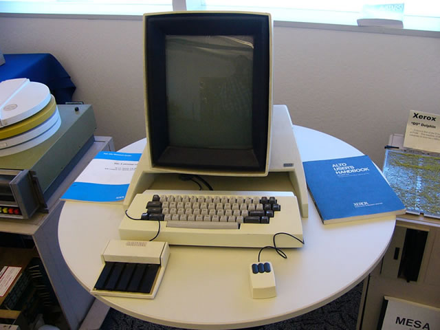
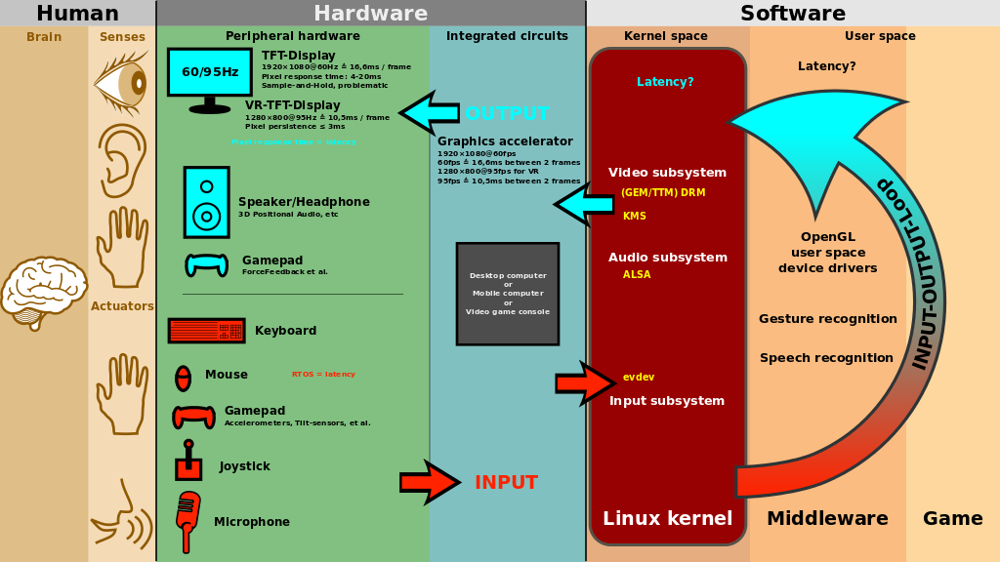

# Human-Computer Interaction
Human–computer interaction (HCI) is research in the design and the use of computer technology, which focuses on the interfaces between people (users) and computers. 
HCI researchers observe the ways humans interact with computers and design technologies that allow humans to interact with computers in novel ways.

As a field of research, human–computer interaction is situated at the intersection of 
- Computer Science
- Design, 
- Behavioral Sciences,
- Media Studies, and several other fields of study.

---

# HCI

  - Humans interact with computers in many ways, and the interface between the two is crucial to facilitating this interaction. 
  - Desktop applications, internet browsers, handheld computers, and computer kiosks make use of the prevalent graphical user interfaces (GUI) of today
  - Voice user interfaces (VUI) are used for speech recognition and synthesizing systems,
  - The emerging multi-modal and Graphical user interfaces (GUI) allow humans to engage with *embodied character agents*.

--- 

# HCI - Xerox Alto

---

# HCI - Xerox Alto GUI

---

# HCI - GUIs

---

# Multi-modal Interaction 

Two major groups of multimodal interfaces have merged, one concerned in alternate input methods and the other in combined input/output. 

The first group of interfaces combined various user input modes beyond the traditional keyboard and mouse input/output, such as speech, pen, touch, manual gestures, gaze and head and body movements.
The most common such interface combines a visual modality (e.g. a display, keyboard, and mouse) with a voice modality (speech recognition for input, speech synthesis and recorded audio for output). 
However other modalities, such as pen-based input or haptic input/output may be used. 

Key Benefit: Accessibility

---

# Multi-modal Interaction
Key Issue: Managing Ambiguity

  - The methods for solving ambiguities and for providing the correct interpretation of the user's input are organized in three main classes: 
    - prevention
    - a-posterior resolution 
    - approximation resolution methods

---
# Embodied Agents

---

#  Goals of HCI

Much of the research in this field seeks to improve the human–computer interaction by improving the usability of computer interfaces.
HCI takes an interest in:

- Methods for designing new computer interfaces, thereby optimizing a design for a desired property such as learnability, findability, the efficiency of use.
- Methods for implementing interfaces, e.g., by means of software libraries.
- Methods for evaluating and comparing interfaces with respect to their usability and other desirable properties.

---

# Goals of HCI

- Methods for studying human–computer use and its sociocultural implications more broadly.
- Methods for determining whether or not the user is human or computer. Base Study: TURING TEST.
- Models and theories of human–computer use as well as conceptual frameworks for the design of computer interfaces, such as cognitivist user models, Activity Theory, or ethnomethodological accounts of human–computer use.[13]
- Perspectives that critically reflect upon the values that underlie computational design, computer use, and HCI research practice

---

---
# Iterative Design

Iterative design: After determining what users, tasks, and empirical measurements to include, the following iterative design steps are performed:
- Design the user interface
- Test
- Analyze results
- Repeat

The iterative design process is repeated until a sensible, user-friendly interface is created.

---
# HCI Bibliography

http://hcibib.org/
