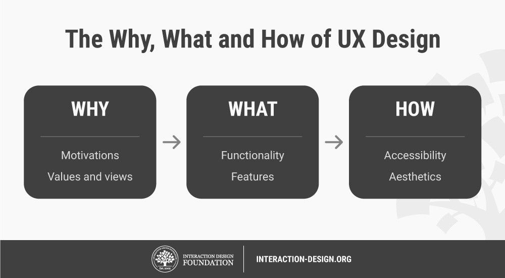
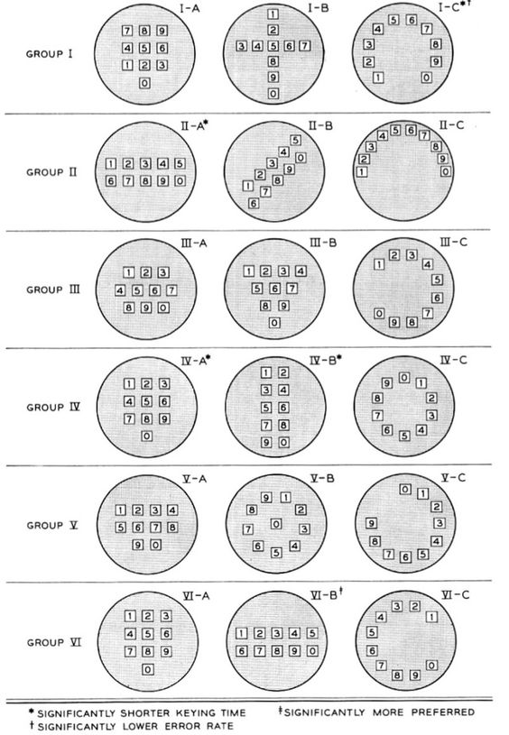
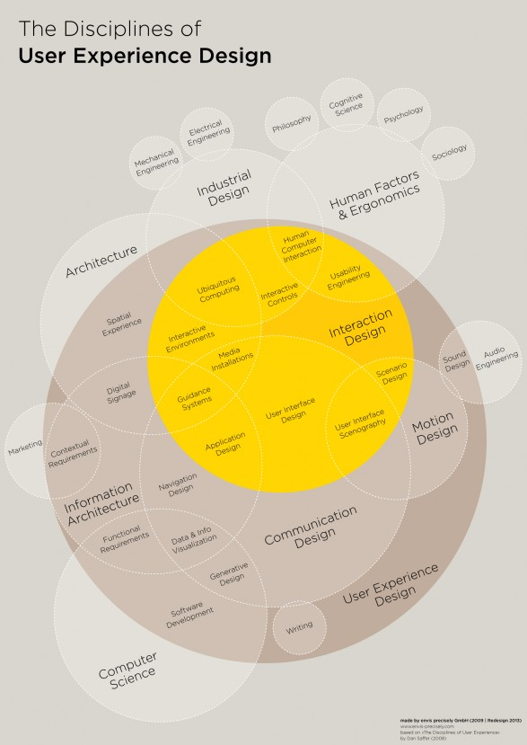
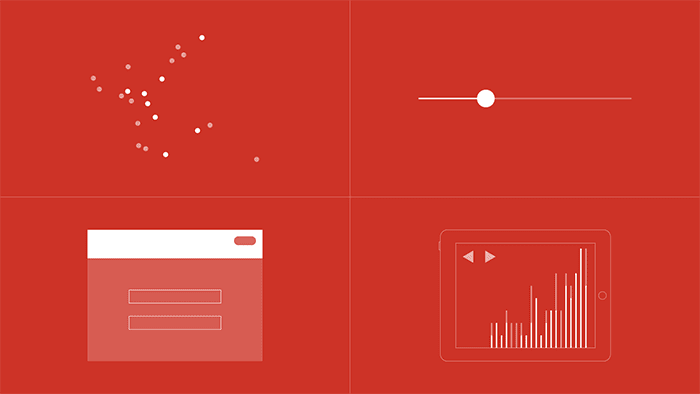
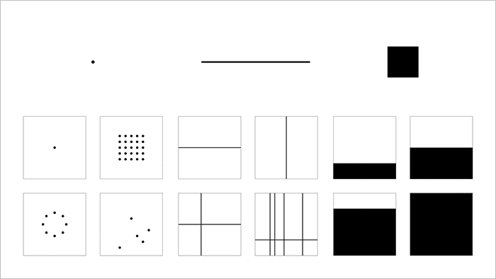
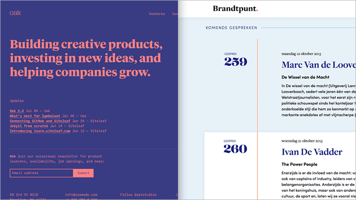
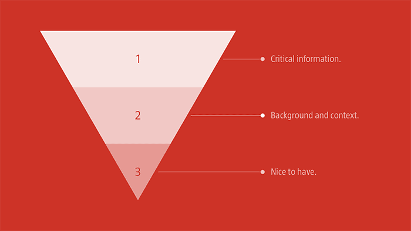

# UX Design
User experience (UX) includes all the aspects of the interaction between the end-user with the company, its services, and its products.

UX design is the process design teams use to create products that provide meaningful and relevant experiences to users. This involves the design of the entire process of acquiring and integrating the product, including aspects of branding, design, usability and function.

---

# UX Design

What UX Designers do goes Beyond UI Design
- Initial Motivations
- Seamlessness between functionality and final reflection
- Providing Narrative / Story
- Help, Service, Maintenance ...

---

--- 

# UX Design

- To design for human users also means you have to work with a heightened scope regarding accessibility and accommodating many potential users’ physical limitations, such as reading small text.
- A UX designer’s typical tasks vary, but often include user research, creating personas, designing wireframes and interactive prototypes as well as testing designs.

---

# Brief History
- User Experience is not a new concept, it has been around since the 1950s. It is widely believed that Bell Labs were the first to introduce the “human” element to developing interactive systems back in the 1950s when they employed psychologists to design their revolutionary telephone dial.
---

**Bell Labs Phone Dial Layout (1950s )**

---

# Brief History
- From the Chienese Philosophy Feng Shui to Ancient Greeks & Ergonomics (Hippocrates), to Walt Disney
- The term was first coined in 1993 by the cognitive psychologist and designer Don Norman when he worked at Apple Computer (Don Norman on the term "UX": https://www.youtube.com/watch?v=9BdtGjoIN4E )

   

---

# Brief History

Several developments affected the rise of interest in the user experience.

1. Recent advances in mobile, ubiquitous, social, and tangible computing technologies have moved human-computer interaction into practically all areas of human activity. This has led to a shift away from usability engineering to a much richer scope of user experience, where users' feelings, motivations, and values are given as much, if not more, attention than efficiency, effectiveness and basic subjective satisfaction (i.e. the three traditional usability metrics.)

---

# Brief History 

2. In website design, it was important to combine the interests of different stakeholders: marketing, branding, visual design, and usability. Marketing and branding people needed to enter the interactive world where usability was important. Usability people needed to take marketing, branding, and aesthetic needs into account when designing websites. User experience provided a platform to cover the interests of all stakeholders: making web sites easy to use, valuable, and effective for visitors. This is why several early user experience publications focus on website user experience.

---

---
# Three Principles
1. Visual Grammar
2. Language & Typography
3. Narrative / Story

---

# Visual Grammar

A point marks a position in space. Two points, connected, form a line. A series of points, connected and filled, form a plane. These are the building blocks of visual design. Spending some time learning how they work — at a fundamental level — will improve your skills as a designer.

---

# Visual Grammar

---
# Visual Grammar
Example: Josh Worth’s website *If the Moon Were Only 1 Pixel*
https://joshworth.com/dev/pixelspace/pixelspace_solarsystem.html

---
# Typography & Language

When 95% of the information on the web is written language, it is only logical to say that a web designer should get good training in the main discipline of shaping written information, in other words: typography.

---
# Typography 
 
With your language clearly defined it’s important to consider how typography can be used to:

- optimize *legibility*, through the appropriate choices of **typefaces**,
- improve *accessibility*, by considering **contrast between the foreground and background colors**, and
- improve *usability*, through a considered **typographic hierarchy**.

Useful Website: https://practice.typekit.com/

---
 

---
# Narrative 
**Inverted Pyramid Principle**

---

# Narrative

Jakob Nielsen wrote about the inverted pyramid as applied to the world of the web over two decades ago in 1996. Nielsen’s **Inverted Pyramids in Cyberspace** is still well worth reading. Principles:

- Start with the information your users absolutely need and ensure it is right up front.
- Provide additional information that’s helpful, but not critical.
- Close with the “nice to have” information ━ for those readers who stuck with you until the bitter end.

---

# Narrative

- Alternative routes into the content, via both a scrolling view and a grid view.
- A color palette which affords each feature its own distinctive look and feel.
- Restrained typography, which focuses the story on the illustrations.

---

# Tips

As you start to wireframe out a new project, it’s important to consider the structure and the pacing of your narrative. Put some thought into how your content is structured and grouped logically. Paper prototyping is the quickest way to get a feel for a user’s flow through your narrative. 

---
# Useful Links
Rochester Institute of Technology's 'Mini-Course in Design Principles: http://www.rit.edu/~w-rkelly/resources/pdf/04_cou/cou_des.pdf

https://uxplanet.org/

Interview with Don Norman: https://web.archive.org/web/20131207190602/http://www.adaptivepath.com/ideas/e000862/

A Brief History: https://thenextweb.com/news/a-brief-history-of-ux-design-and-its-evolution

