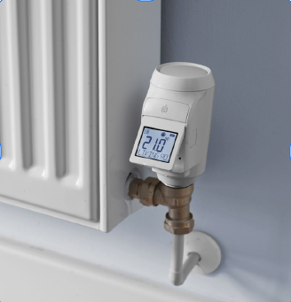
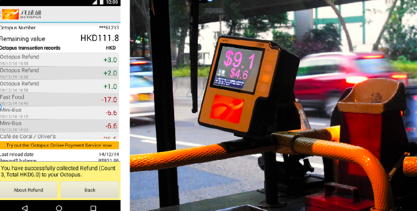
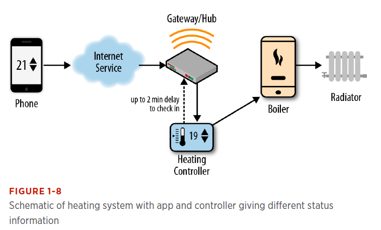
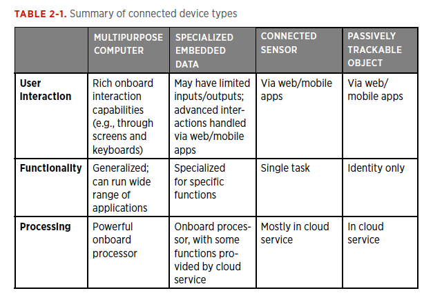
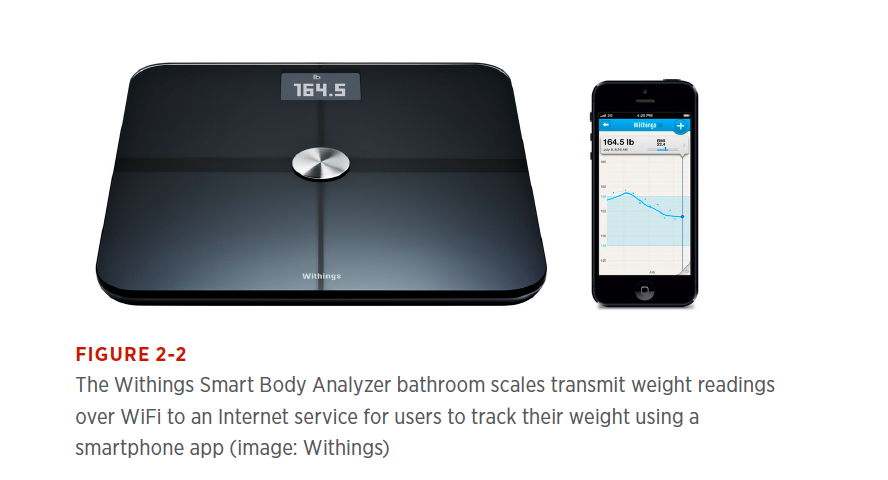

# Internet of Things (IoT)

The “Internet of Things” (IoT) refers to the growing range of everyday objects acquiring connectivity, sensing abilities, and increased com-puting power. In consumer terms, some common categories currently include:
•	Connected home technology (such as thermostats, lighting, and energy monitoring)
•	Wearables (such as activity/fitness trackers and “smart” watches)
•	Medical/wellness devices (such as bathroom scales and blood pres-sure monitors)
•	Connected cars (which may provide access to smartphone apps via dashboard controls, engine diagnostics, and automatic alerting of authorities in case of a crash)
•	Urban systems (such as air quality sensors, city rental bikes, and parking meters/sensors)

---

# Cross-Platorm and IoT Challenges

Designing for IoT comes with a bunch of challenges that will be new to designers accustomed to pure digital services. How tricky these chal-lenges prove will depend on:
•	The maturity of the technology you’re working with
•	The context of use or expectations your users have of the system
•	The complexity of your service (e.g., how many devices the user has to interact with)

---

--- 

# The "Internet" Part of IoT
When we talk about IoT, we tend to focus on the devices, particularly those with striking or novel forms. But the behavior of the device might be generated by a program that lives on another device on the network (i.e., a server). We call this the Internet (or “cloud”) service.
This means that the service around a connected device is often just as critical in delivering the user experience, if not more so, than the device itself.

---

# General Working Principle of Connected Devices
Many connected devices run on batteries, and need to conserve electricity. Maintaining net-work connections uses a lot of power, so they only connect intermit-tently. This means that parts of the system can be out of sync with one another, creating discontinuities in the user experience. 

---

# A Typical IoT is composed of:
-	One or more embedded devices (the "things" in IoT)
-	An Internet service
-	Perhaps a gateway device (a separate device needed to connect some embedded devices to the Internet)
-	One or more mobile or web apps for the user to interact with the service via a mobile, tablet, or PC

Tip: Your course book *Designing Connected Products* offers detailed explanation of the working principles of each element in different chapters. Please read *Chapter 1* for the overview which these slides are based on.

---

# Design Aspects
The two most visible and tangible forms of design for IoT are: 
 - The UI/visual design: For example, the screen layout and look and feel of the web or mobile apps, or devices themselves . (UIs don’t have to be visual; they can use audio, haptics, and other channels. But it’s rare for a service to have no screen-based UI at all.) 
 - The industrial design of the physical hardware: The form factor, styling, and capabilities of the connected devices themselves.

Other Aspects: Interaction Design, Interusability, Service Design, Conceptual Model, Productization, Platform Design (a software platform will aim to solve many technical issues, many of which may not directly have an impact on the UX)

---

# The "Things" Part of IoT

Connected devices can take a number of forms, and are typically one of the following:
•	Multipurpose computers
•	Specialized embedded devices
•	Connected sensors2
•	Passively trackable objects

Most systems will be composed of multiple types. For example, a con-nected home system may have:
•	A control interface on a smartphone (multipurpose computer)
•	Heating/ventilation/air conditioning (HVAC) controller, remote control door locks, and blind controllers (specialized embedded devices)

---

---
# General Purpose Computers VS. Embedded Devices
- Specialized to perform particular tasks, embedded devices come in a wide range of form factors to suit the task and may have other mechani-cal parts (such as a washing machine) or even other embedded systems as well (such as a car).  

- Mobile phones were historically considered embedded devices, as they were highly specialized devices. Modern smartphones are more like general-purpose computers in terms of what they can do for the user, as there are so many ways to extend their functionality through apps.

---

---

# Embedded Hardware & Embedded Software
- An embedded system (the computing part of the embedded device) has some basic types of hardware components in common with a gener-al-purpose computer, such as a central processor, memory, and periph-erals (although these components may be integrated onto a single chip called a microcontroller, whereas in a multipurpose computer they would often be separate parts). 

- Software for embedded systems is designed to make efficient use of limited resources. A simple device may have only a small, fixed-function program (firmware), just enough to make the system work. This is stored in nonvolatile memory (memory that is not lost when the device is not powered) such as Flash or ROM.

---

# Connected Sensors
- Connected sensors are small embedded devices used for capturing data from the physical world, and passing this to a networked service. Although technically a class of embedded device, they tend to be used and experienced in a different way as part of the Internet of Things.
- The focus of the UX is not on the devices, but on the data that is captured and the service that the data enables.

- A connected sensor typically contains just enough onboard computing to gather data and transmit it over a network. This is likely to mean a very basic processing unit with very limited memory and computing power, a communication transceiver, and a battery or other power source (e.g., energy harvesting from the environment, such as solar or wind power).

---
# Other Features
Trackable Objects (Simple objects, which need not have any onboard computing at all, can be identified via radio-frequency identification (RFID) or a quick response (QR) code)
