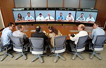
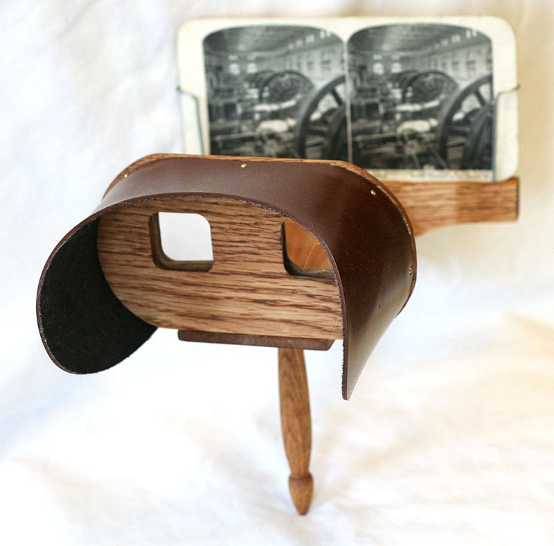
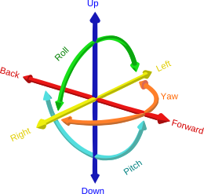
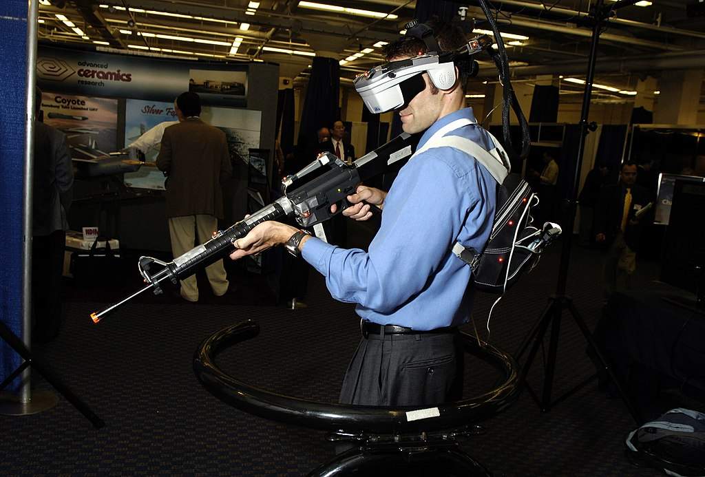

# Immersive Media

We define IM as media that stimulate physical senses to the point where we experience psychological immersion,also referred to as telepresence. IM have the capability to make users so involved in the filmed, photographed,synthetic, or mixed environment that they have an impression that it is real and that they are present in thisenvironment (so called “being there”). 

(PDF) Immersive Media and their Future. Available from: https://www.researchgate.net/publication/328340651_Immersive_Media_and_their_Future 

---

# From Established Media (EM) to Immersive Media (IM)

EM are defined as media that once were considered as new, innovative, and trendy. However, EM are nowcommonly-used and generally-accepted by a mass-market audience. Similarly to IM, EM can be immersive as well. However, their immersion level is lower, and does not qualify as achieving *telepresence*.

- *Telepresence* refers to a set of technologies which allow a person to feel as if they were present, to give the appearance or effect of being present via telerobotics, at a place other than their true location. The concept covers from telephone to IMAX.
- The commercial history of telepresence starts with hospitality and the company *Teleport* for business people.

--- 

---

# Brief History of EM

While radio, film, and TV became accepted media for education, IM did not catch on in the same manner.One of the earliest attempts can be traced back to the 19th century, when the key component of VR systems,stereoscopic viewing, became popular and allowed students to see and learn about remote places. 

---

---

# Immersion

Immersion into virtual reality (VR) is a perception of being physically present in a non-physical world. The perception is created by surrounding the user of the VR system in images, sound or other stimuli that provide an engrossing total environment.

- Disadvantages: motion sickness. 
- Because most currently feasible telepresence gear leaves something to be desired; the user must *suspend disbelief* to some degree, and choose to act in a natural way, appropriate to the remote location, perhaps using some skill to operate the equipment. 
---

# Different Types of Immersion

According to Ernest W. Adams, immersion can be separated into three main categories:

- **Tactical immersion**: Tactical immersion is experienced when performing tactile operations that involve skill. Players feel "in the zone" while perfecting actions that result in success.
- **Strategic immersion**: Strategic immersion is more cerebral, and is associated with mental challenge. Chess players experience strategic immersion when choosing a correct solution among a broad array of possibilities.
- **Narrative immersion**: Narrative immersion occurs when players become invested in a story, and is similar to what is experienced while reading a book or watching a movie.

---

# Different Kinds of Immersive Media

In the case of something like 3D content, you would be able to see a flat sphere of visual content around you which adapts according to your position or view, managed by 3 degrees of freedom (3DoF). 

In the case of extended reality (AR, VR, and MR), immersive media would map your experience onto a physical space, allowing for deeper interactions. This is known as 6 degrees of freedom, or 6DoF.

----

**6 Degrees of Freedom**

---

Most kinds of immersive media fall into either 3DoF or 6DoF categories. Options include:

- Virtual reality: VR is the most commonly referenced content in immersive media. It involves using a virtual or digital environment to replace a real-world space. VR fully immerses the user in a digital world through head-mounted displays and sensors.
- Augmented reality: Augmented reality, or AR brings the digital content into a real-world environment. This allows for the enhancement, rather than the replacement of your physical surroundings.

--- 

- Mixed reality: Mixed reality blends the real and digital world in an environment where they can co-exist. Mixed reality experiences can include things like holograms or holoportation, and they allow for a much deeper level of interaction than AR.
- 3D content: 3D videos and images allow you to surround yourself with a kind of unique image or video. This allows for immersion within the media, but there’s usually no way of interacting with the content directly, without the use of a smartphone or similar device.

---

# Immersive VR
Immersive virtual reality is a technology that aims to completely immerse the user inside the computer generated world, giving the impression to the user that they have "stepped inside" the synthetic world. This is achieved by either using the technologies of Head-Mounted Display(HMD) or multiple projections. This means that the service around a connected device is often just as critical in delivering the user experience, if not more so, than the device itself.

---

---

# Generating VR
There are two methods of generating VR content. 
- The first employs game engines, such as Unity or Unreal. 
- The second method is to adapt filmed or photographed content in a 360° or 180° format. Game-engine-generated content is published in a similar way as applications in app stores: with a thumbnail, a title, a teaser, and a link to download the app. 

Example: Oculus Rift

---

Immersive Media Art: 100.000 Cities:

https://www.youtube.com/watch?v=zreCsAlRHJk

https://marclee.io/en/10-000-moving-cities-same-but-different/

