# Key Concepts 

-  Applications and softwares have common global actions to enable tasks.
- *Interface* enables the users to perform these tasks.
- *UI / UX* defines the field where the user interface and the experience this interface provides to the users are defined through design principles. 

---

# Classification
## Application Software, Web Application, Apps

- By property and use rights: closed vs open
- By coding language: web applications vs native applications
- By purpose and output: horizontal vs vertical (suites, CRM, educational, simulation etc...)
- By platform
- Other Types (Information Worker, Entertainment, Educational, Enterprise, Simulation, Media Development, Engineering)

---

#  Web Application
A web application is application software that runs on a web server, unlike computer-based software programs that are run locally on the operating system (OS) of the device. Web applications are accessed by the user through a web browser with an active network connection. 
- A rich web application (originally called a *Rich Internet Application* [RIA] or installable internet application) is a web application that has many of the characteristics of desktop application software. Example: Adobe Flash
- Single-page applications are more application-like because they reject the more typical web paradigm of moving between distinct pages with different URLs. Example: Gmail, Facebook, Twitter...

---

Software Art Example: https://www.liaworks.com/videos/sv15-divco-west/

---

# "Thoughts on Flash"

- While some features of HTML5 are often compared to Adobe Flash, the two technologies are very different. Both include features for playing audio and video within web pages, and for using Scalable Vector Graphics. However, HTML5 on its own cannot be used for animation or interactivity – it must be supplemented with CSS3 or JavaScript. 
- *Steve Jobs' letter in 2010*: "Flash is no longer necessary to watch video or consume any kind of web content. [...] New open standards created in the mobile era, such as HTML5, will win on mobile
devices (and PCs too)."

---

# Interfaces

- UI (User Interface)
  - The goal of user interface design is to produce a user interface which makes it easy, efficient, and enjoyable (user-friendly) to operate a machine in the way which produces the desired result (i.e. maximum usability). This generally means that the operator needs to provide minimal input to achieve the desired output, and also that the machine minimizes undesired outputs to the user.

- API (Application Programming Interface)
  - An API is often made up of different parts which act as tools or services that are available to the programmer. A program or a programmer that uses one of these parts is said to call that portion of the API. 

---

- CUI 
  - *Composite user interfaces* (CUIs) are UIs that interact with two or more senses. The most common CUI is a **graphical user interface** (GUI), which is composed of a tactile UI and a visual UI capable of displaying graphics. 
  -  Standard CUI use standard human interface devices like keyboards, mice, and computer monitors. When the CUI blocks out the real world to create a **virtual reality**, the CUI is virtual and uses a virtual reality interface. When the CUI does not block out the real world and creates augmented reality, the CUI is augmented and uses an **augmented reality interface.** 

---

# Interactive Features of Web Applications

- Data Display / Management
- Data Manipulation / Control
- Authorization

--- 

#  Properties
1. Additive: Add, Copy, Paste, Create, New
2. Removal: Undo, Remove, Close, Delete
3. Save: Autosave, refresh

---

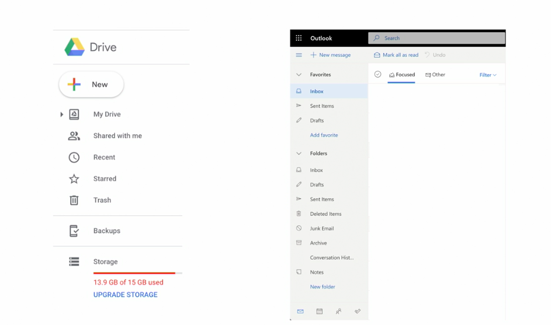

---

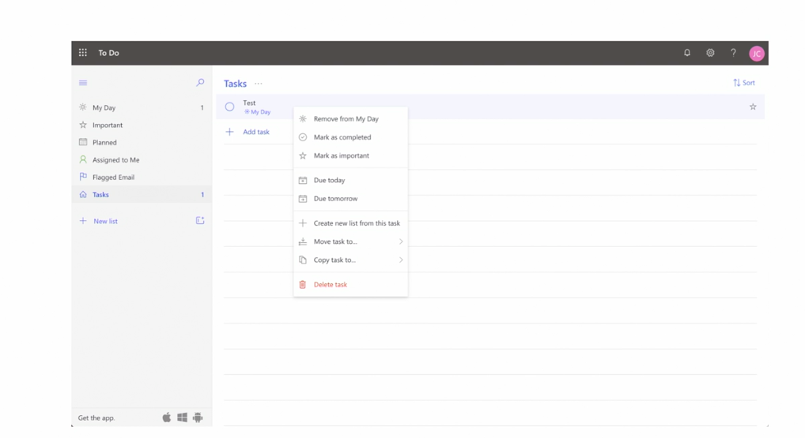

---

#  Customizable Actions
1. Keyboard Shortcuts, 2. Toolbars, 3. Menus

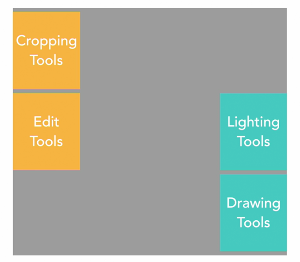

---

#  Navigation Headers

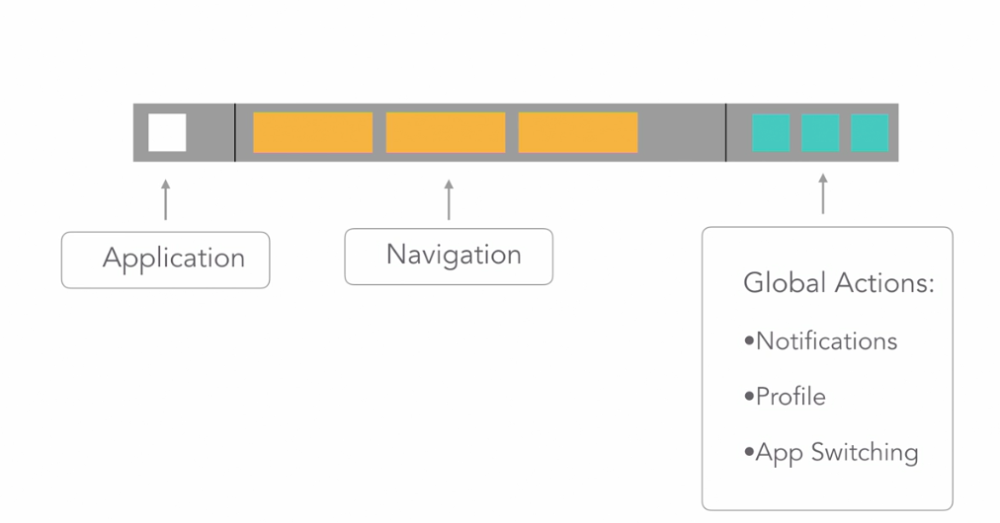

---

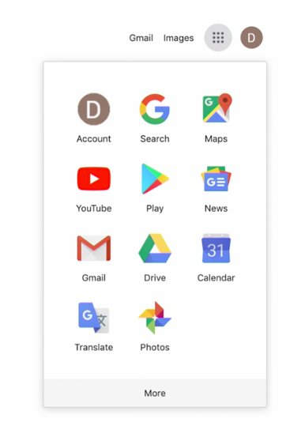

---

#  Tables & Data
Table Design Elements: Headers, Rows, Columns, Pagination

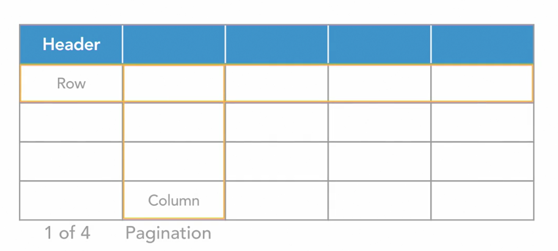

---

#  Tables Actions
1. Search
2. Filter
3. Batch Actions
4. Row Actions
5. Editing
6. Creating 
7. Deleting

---

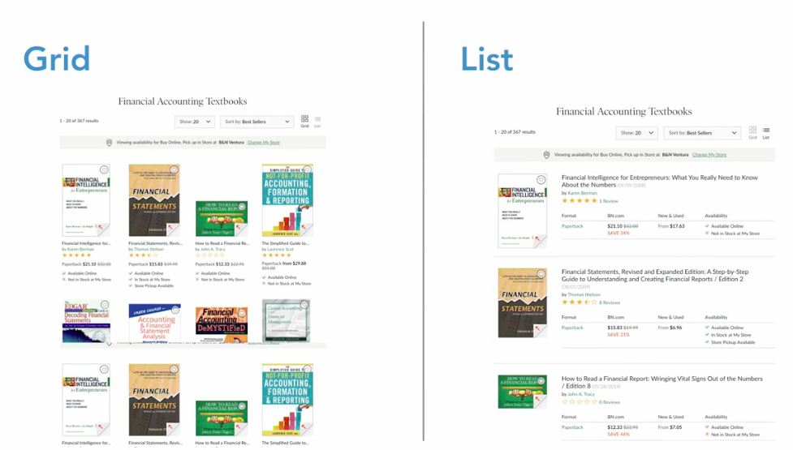

---
#  Tree View (Nested Lists)

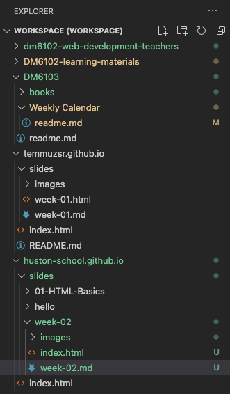

---
# Controls (Toolbars)

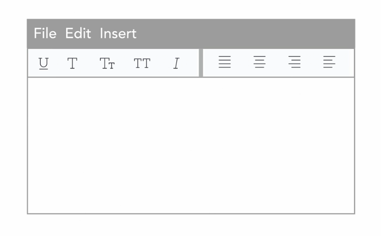

---

# Controls (Drag and Drop)
- Key Interactions: Dragging the object, drag zone, feedback
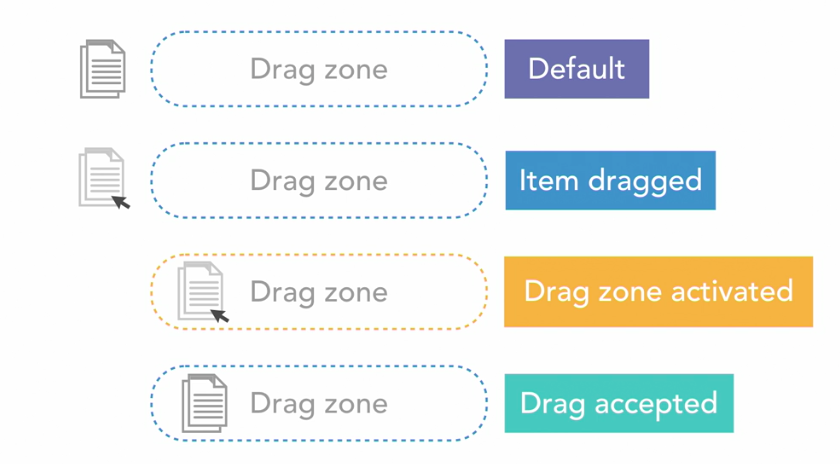

- Common Icons
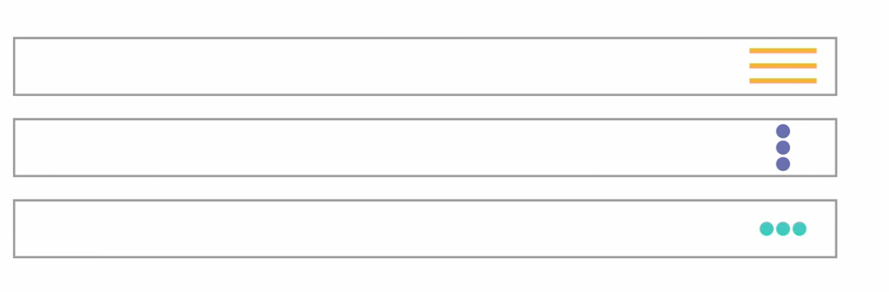

---

# Controls (Sliders)
- Range and relativity
- Interaction: dragging a dial across a track
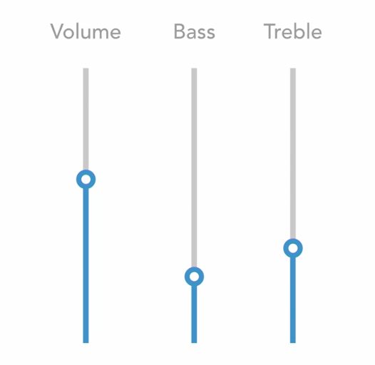

---

# Controls (Menus)
- Groupings and organization
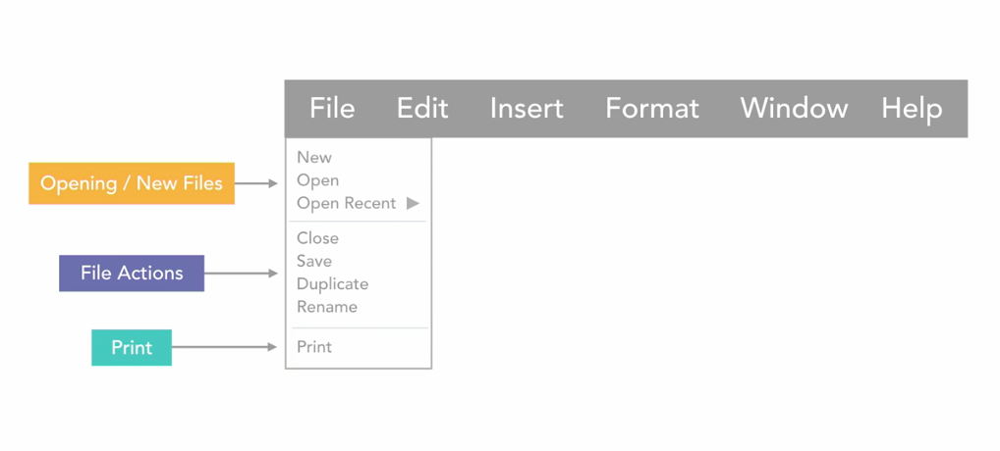

---

# Assignment 1 - Application Comparison
- Find two applications that do the same job and work on two different platforms. 
- Analyze at least 4 different activities that can be performed through the application 
- Evaluate 
  - Functionality through controls
  - Pagination 
  - Navigation 
  - Customization Options
  - Authorization (Login / Logout) 
- Is it a single-page application?

(Tip: Check Chapter 4 of *Interaction Design for Web* LinkedIn Learning Course)

