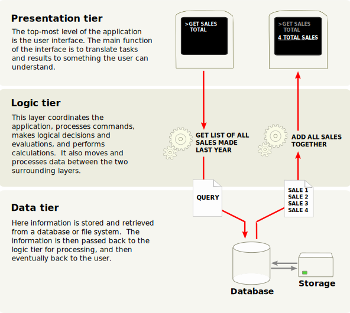
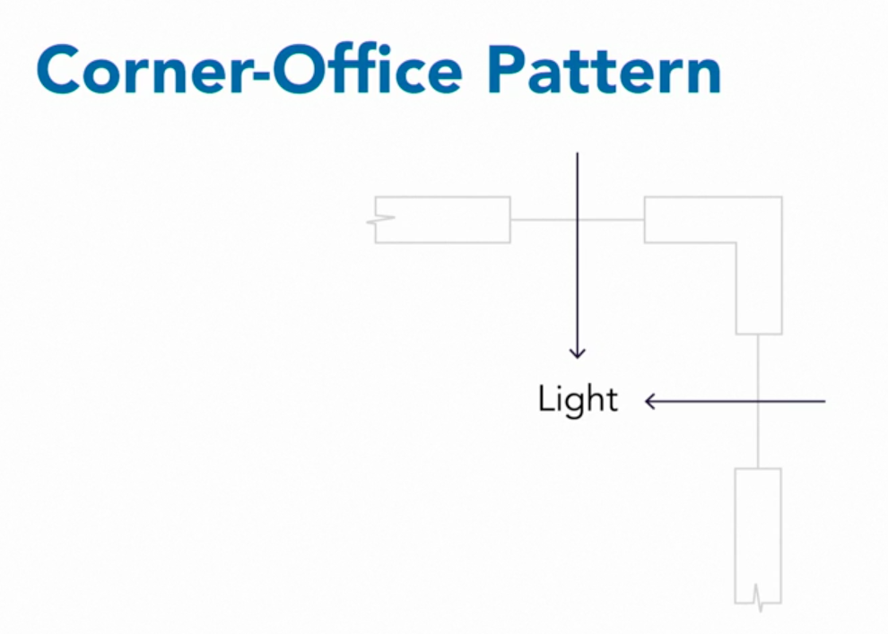
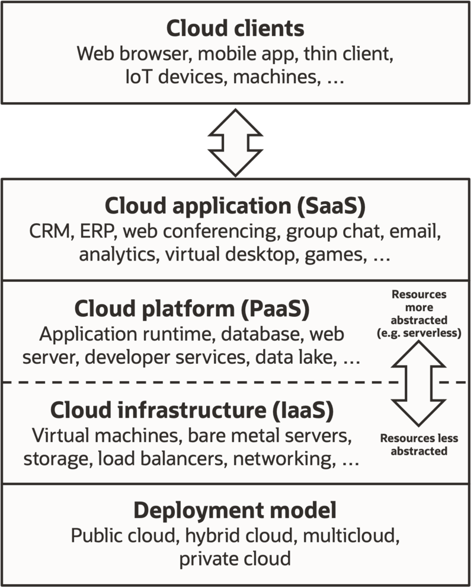

# Key Concepts 

- Software Architecture & Design Patterns
- Cloud Computing and Software, Infrastructure and Platform as A Service (SAAS, IAAS, PAAS)

---

# Software Architecture
*Software architecture* is an "intellectually graspable" abstraction of a complex system. This abstraction provides a number of benefits:
  - It gives a basis for analysis of software systems' behavior before the system has been built.
  - It provides a basis for re-use of elements and decisions.
  - It facilitates communication with stakeholders, contributing to a system that better fulfills their needs.
  - It helps in risk management. Software architecture helps to reduce risks and chance of failure.
  - It enables cost reduction. Software architecture is a means to manage risk and costs in complex IT projects.

---

#  Architectural Styles and Design Patterns
Architectural styles are reusable 'packages' of design decisions and constraints that are applied to an architecture to induce chosen desirable qualities.

- Plugin
- Peer-to-Peer
- Component-based
- Rule-based
- Client-server (n-tier)
- ...

---

# Three-tier Structure

---

# Design Patterns

Software design involves problem-solving and planning a software solution. This includes both a low-level component and algorithm design and a high-level, architecture design.

- A *design pattern* is the re-usable form of a solution to a design problem. (The idea was first introduced by the architect Christopher Alexander in the 1970s)

---

# Design Patterns
Documenting a pattern requires explaining why a particular situation causes problems, and how the components of the pattern relate to each other to give the solution. Alexander describes common design problems as arising from "conflicting forces"—such as the conflict between wanting a room to be sunny and wanting it not to overheat on summer afternoons.

---
- Design patterns may be viewed as a structured approach to computer programming intermediate between the levels of a programming paradigm and a concrete algorithm.

- Model–view–controller (MVC) is a software design pattern commonly used for developing user interfaces that divide the related program logic into three interconnected elements. This is done to separate internal representations of information from the ways information is presented to and accepted from the user.

---

# MVC Process

--- 

# Cloud Computing

Cloud computing is the on-demand availability of computer system resources, especially data storage (cloud storage) and computing power, without direct active management by the user. It is based on *distributed computing* which refers to sharing the computing workload among many computers across a network. 
- Ability to pay for only the resources you use
- Ability to scale up and back as needed
- Available for different types of use: public, private, community, hybrid...
- Delivery Models: Software as a Service, Infrastructure as a Service, Platform as a Service

---

# Cloud Computing Service Models

